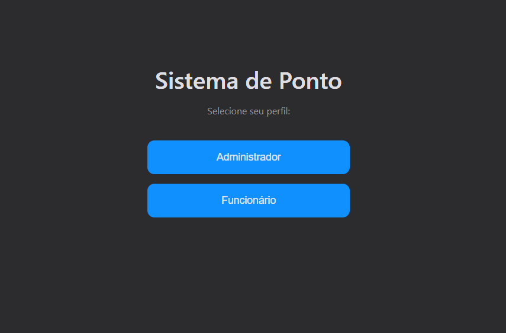
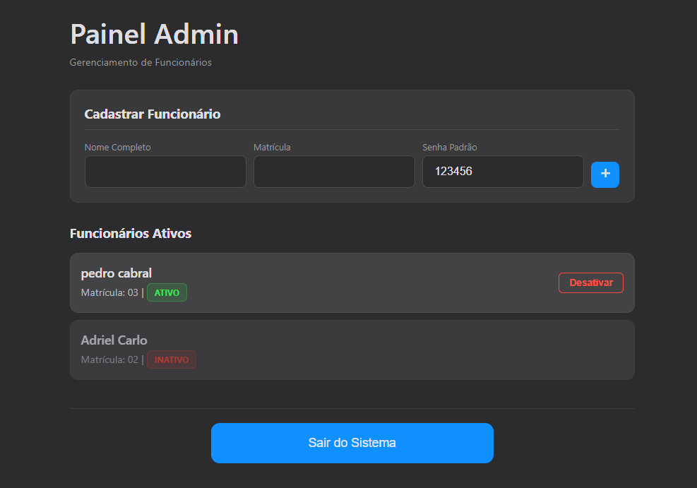
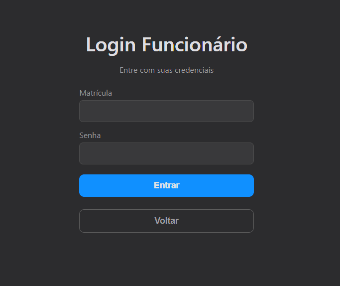
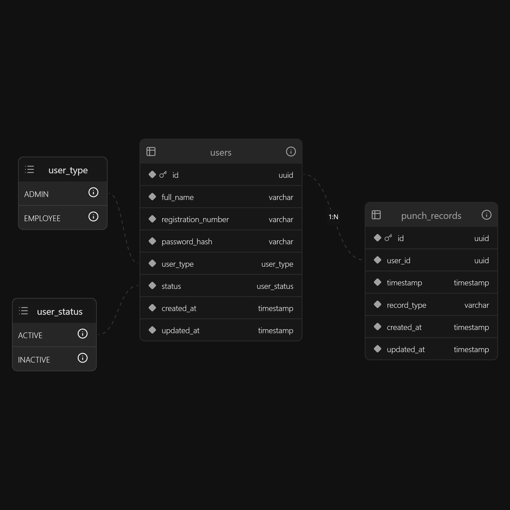
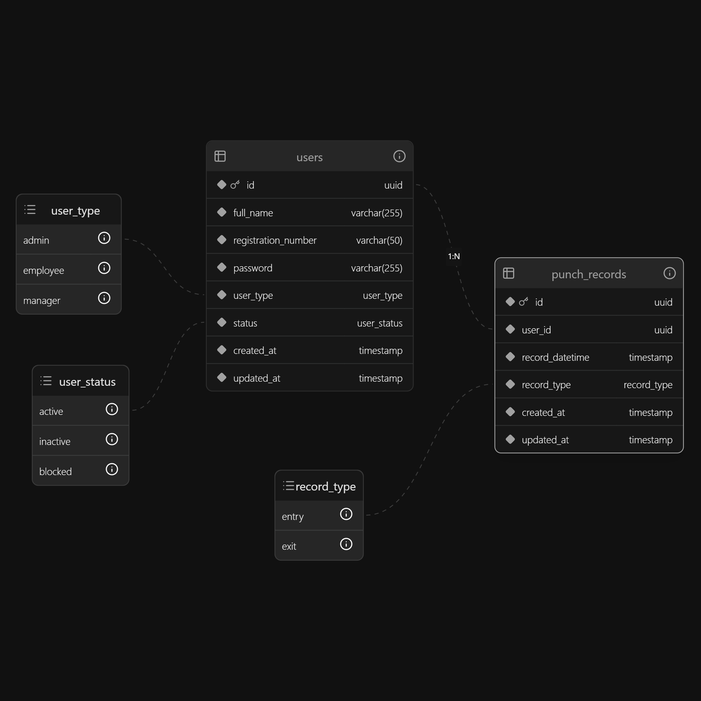
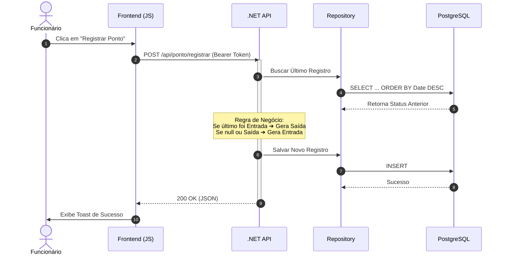

# Sistema Simplificado de Ponto v1.0


## Descrição

Este projeto implementa um sistema básico para registro de ponto de funcionários, consistindo em uma API backend desenvolvida em C# com .NET 8 e uma interface frontend simples em HTML/CSS/JS. O sistema permite o cadastro de funcionários, autenticação e o registro de horários de entrada e saída. A gestão de funcionários (listar, desativar) é feita por um perfil de Administrador.

Esta versão (v1.0) representa o Produto Mínimo Viável (MVP) do sistema.

---

## 📸 Galeria do Sistema

### 1. Tela de Login Unificada
Design limpo e focado na experiência do usuário.  


### 2. Painel do Administrador
Gestão completa: Cadastro de funcionários e visualização de status (Ativo/Inativo) com ordenação inteligente.  


### 3. Ponto Eletrônico (Funcionário)
Relógio em tempo real e botão inteligente que alterna entre Entrada e Saída.  


---

## 🏛️ Arquitetura e Modelagem

O sistema foi desenhado seguindo boas práticas de engenharia de software. Abaixo estão os diagramas que ilustram a estrutura do projeto.

### Estrutura do Backend (Clean Architecture)
Visão das camadas da aplicação e suas responsabilidades.  


### Modelagem de Dados (DER)
Estrutura relacional do banco de dados PostgreSQL.  


### Fluxo de Registro (Sequence Diagram)



---

## Funcionalidades Principais (v1.0)

### Funcionário:
- Login via Matrícula e Senha  
- Registro de Entrada e Saída (com validação de sequência)  
- Logout  

### Administrador:
- Login via Matrícula e Senha  
- Visualizar lista de funcionários cadastrados (excluindo outros admins)  
- Desativar um funcionário (impedindo seu login)  
- Logout  

---

## Arquitetura e Tecnologias

- **Backend:** C# com .NET 8  
- **Arquitetura:** Clean Architecture (Domain, Application, Infrastructure, Api)  
- **Banco de Dados:** PostgreSQL (via Docker)  
- **ORM:** Entity Framework Core 8  
- **Autenticação:** JWT (JSON Web Tokens)  
- **Segurança:** Hash de senha com BCrypt  
- **Testes:** xUnit + Moq  
- **Documentação:** Swagger (OpenAPI)  
- **Frontend:** HTML, CSS, JavaScript (sem frameworks)  
- **Ambiente:** Docker e Docker Compose  

---

## Pré-requisitos

- .NET 8 SDK  
- Docker Desktop  

---

## Como Configurar e Rodar o Projeto

### 1. Clone o Repositório

```bash
git clone https://github.com/herethere04/sistema-ponto-api
cd sistema-ponto-api
git checkout mvp
```

Certifique-se de que o Docker Desktop está rodando.

### 2. Construa e Inicie os Containers

Na pasta raiz do projeto:

```bash
docker-compose up --build
```

Após a primeira execução, apenas `docker-compose up` será suficiente.

---

### 3. Caso dê erro de tabela ou de api é um "race condition", apenas use este comando no terminal na pasta raiz

```bash
docker restart sistema-ponto-api
```

## Acessando a Aplicação

- **Frontend:** Abra `frontend/index.html` usando Live Server / Live Preview ou diretamente no navegador.  
- **API (Swagger):** Acesse:  
  `http://localhost:8080/swagger`

---

## Credenciais Padrão (Seed Automático)

**Administrador**  
- Usuário: `admin`  
- Senha: `admin123`

---

## Configuração do Banco (Docker Compose)

- Usuário: `admin`  
- Senha: `admin123`  
- Banco: `sistemapontodb`  
- Porta: `5432`  

---

## Próximas Versões (Roadmap)

- Implementar cálculo de horas trabalhadas  
- Frontend: Cadastro de usuário pelo Admin  
- Frontend: Visualização detalhada do histórico de ponto  
- Frontend: Funcionário visualizar seu histórico/saldo  
- Backend: Reativar usuários  
- Mais testes automatizados  

